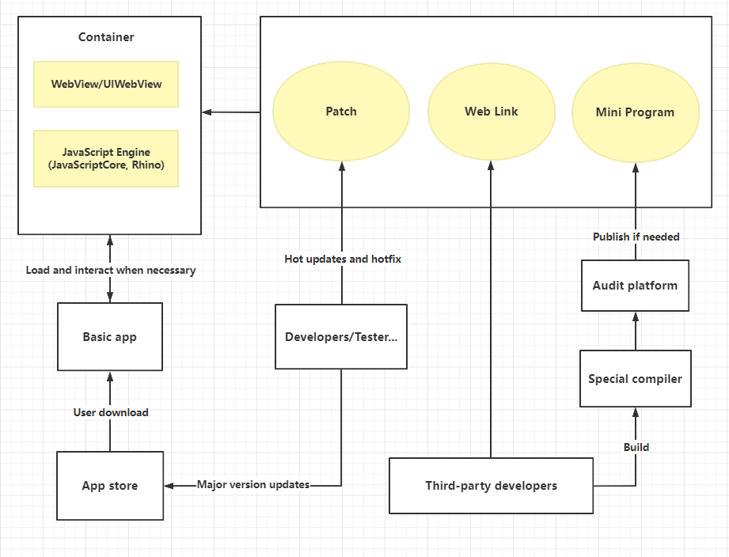

As you can see from the image above, To Implement the super application mentioned in the question, technically, the two main points are `WebView` and `JavaScript Engine`.

First, we will develop a basic app, and then we can use `Webview` to load third-party web link, this is one of method to provide various third-party services for our app. The performance of `WebView` is not high, it depends on the browser core, and sometimes native APIs don't support it ideally either. 

To address these issues, we can use `JavaScript Engine` like `JavaScriptCore`, `Rhino`. JavaScript has a good and huge ecosystem, it can save a lot of development costs. In this respect, developers can use the agreed, JavaScript-like language to complete a mini program easily and use special compiler to make its code work in our super app.

When the development is complete, developers can publish it to a Audit platform and then to the cloud If the audit is approved, Once they are published to the cloud, our super app can load them.

About the release of super app, one is the traditional method that is to sent it to app store, but it's difficult to achieve hot updates or hotfix. Here, we can use module replacement. For example, if the app has a bug in module **A**, we can send an module **A** containing a fix patch to cloud, and it will be loaded preferentially when app restarts. In this way, we can provide the updated version quickly to the customer.  Of course, there are many ways to achieve hot updates and hotfix.
